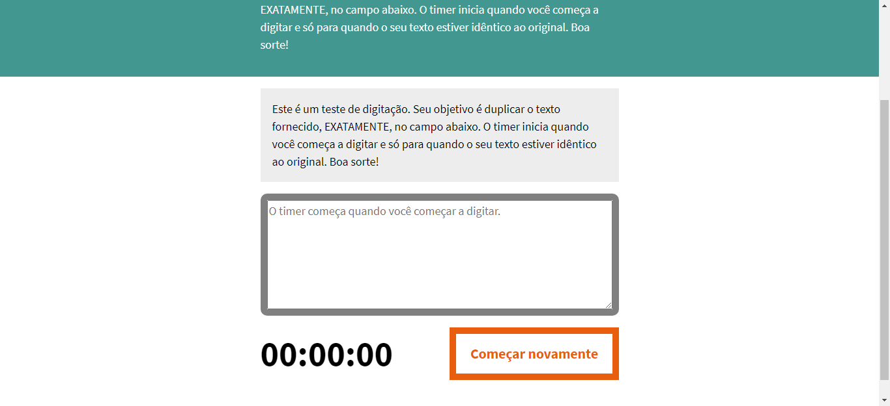

# linkedin-learning-js
Exercicios e atividades do curso de formacão básica em JavaScript do linkedin learning !


## Sobre
Este repositorio tem como intuito apresentar um pouco sobre pos projetos desenvolvidos durante o curso
de "Javascritp formação básica" do Linkedin Learning


## Peojeto um (O RELÓGIO ANALOGICO)<ul>

Um projeto utilizando Javascrip para fazer um relógio fincional, que atualiza de 
segundo em segundo mexendo seus ponteiros.

  
  
Arquivo .js
  
```
const PONTEIROHORA = document.querySelector("#hour");
const PONTEIROMINUTO = document.querySelector("#minute");
const PONTEIROSEGUNDO = document.querySelector("#second");

var date = new Date();
console.log(date);

let hr = date.getHours();
let min = date.getMinutes();
let seg = date.getSeconds();
console.log("Hora: " + hr + " Minuto: " + min + " Segundo: " + seg);

let posicaoHr = (hr*360/12)+(min*(360/60)/12);
let posicaoMin = (min*360/60)+(seg*(360/60)/60);
let posicaoSeg = seg*360/60;

function executarRelogio() {
    posicaoHr = posicaoHr+(3/360);
    posicaoMin = posicaoMin+(6/60);
    posicaoSeg = posicaoSeg+6;

    PONTEIROHORA.style.transform = "rotate(" + posicaoHr + "deg)";
    PONTEIROMINUTO.style.transform = "rotate(" + posicaoMin + "deg)";
    PONTEIROSEGUNDO.style.transform = "rotate(" + posicaoSeg + "deg)";
}

var intervalo = setInterval(executarRelogio, 1000);
```

## Peojeto dois (Dedafio digitação)

Um projeto utilizando Javascrip para fazer um desafio em que o jogador deve digitar o masi rapido possivel.


  
Arquivo .js
  
```
const testWrapper = document.querySelector(".test-wrapper");
const testArea = document.querySelector("#test-area");
const originText = document.querySelector("#origin-text p").innerHTML;
const resetButton = document.querySelector("#reset");
const theTimer = document.querySelector(".timer");

timer = [0,0,0,0];
var interval;
var timerRunning = false;

// Adiciona zero inicial aos números <= 9 (apenas para estética):
function leadingZero(time) {
    if(time <= 9){
        time = "0" + time;
    }
    return time;
}

// Executa um timer padrão de minuto / segundo / centésimos:
function runTimer() {
    let currentTime = leadingZero(timer[0]) + ":" + leadingZero(timer[1]) + ":" + leadingZero(timer[2]);
    theTimer.innerHTML = currentTime;
    timer[3]++;

    timer[0] = Math.floor((timer[3]/100)/60);
    timer[1] = Math.floor((timer[3]/100) - (timer[0] * 60));
    timer[2] = Math.floor(timer[3] - (timer[1] * 100) - (timer[0] * 6000));
}

// Verifica se texto digitado com o fornecido na página:
function spellCheck() { 
    let textEntered = testArea.value;
    let originTextMatch = originText.substring(0, textEntered.length);
    
    if (textEntered == originText) {
        clearInterval(interval);
        testWrapper.style.borderColor = "#429890";
    } else {
        if (textEntered == originTextMatch) {
            testWrapper.style.borderColor = "#65CCf3";
        } else {
            testWrapper.style.borderColor = "#E95D0F";
        }
    }
}

// Inicia o cronômetro:
function start(){
   let textEnteredLength = testArea.value.length;
    if (textEnteredLength === 0 && !timerRunning) {
        timerRunning = true;
        interval = setInterval(runTimer, 10);
    }
}

// Função de recomeçar:
function reset() {
    clearInterval(interval);
    interval = null;
    timer = [0,0,0,0];
    timerRunning = false;

    testArea.value = "";
    theTimer.innerHTML = "00:00:00";
    testWrapper.style.borderColor = "grey";
}

// Listeners de eventos para entrada de teclado e o botão de recomeçar:
testArea.addEventListener("keypress", start, false);
testArea.addEventListener("keyup", spellCheck, false);
resetButton.addEventListener("click", reset, false);
```

## Peojeto três (Imagensde forma responsiva)<ul>

Um projeto utilizando Javascrip um função que tornaria as imagens do site responsivas.


  
Arquivo .js
  
```
const IMAGES = document.querySelectorAll("img");
const SIZES = {
    showcase: "100vw",
    reason: "(max-width: 799px) 100vw, 372px",
    feature: "(max-width: 799px) 100vw, 558px",
    story: "(max-width: 799px) 100vw, 670px",
};

function makeSrcset(imgSrc) {
    let markup = [];
    let width = 400;

    for (let i = 0; i<5; i++) {
        markup[i] = imgSrc + "-" + width + ".jpg " + width + "w";
        width+=400;
    }

    return markup.join();
}

for (let i = 0; i<IMAGES.length; i++) {
    let imgSrc = IMAGES[i].getAttribute("src");
    imgSrc = imgSrc.slice(0,-8);
    let srcset = makeSrcset(imgSrc);
    IMAGES[i].setAttribute("srcset", srcset);

    let type = IMAGES[i].getAttribute("data-type");
    let sizes = SIZES[type];
    IMAGES[i].setAttribute("sizes", sizes);

}

```


## Redes sociais

* [Linkedin](https://www.linkedin.com/in/adilson-júnior-5b0934187) 
* [Codepen](https://codepen.io/adilson-j-nior) 
* [GitHUb](https://github.com/1Adilson) 

## Contribuição
Todo esses projetos e aprendizados se devem ao Linkedin Learning e a instrutora <b>Amanda Cavallaro</b> por ensinar e disponibilizar todo o ótimo conteúdos.

Contato da <b>Amanda Cavallaro</b> [Linkedin](https://www.linkedin.com/in/amandacavallaro/?trk=lil_course) 

## Finalização
Este projeto foi educativo onde passei a minha visão de colocar em prática meus aprendizados em Javascript

      
