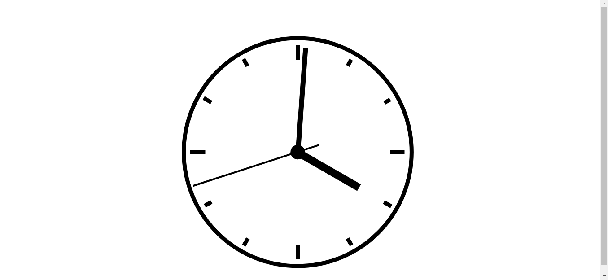

# linkedin-learning-js
Exercicios e atividades do curso de formacão básica em JavaScript do linkedin learning !


## Sobre
Este repositorio tem como intuito apresentar um pouco sobre pos projetos desenvolvidos durante o curso
de "Javascritp formação básica" do Linkedin Learning


## Peojeto um (O RELÓGIO ANALOGICO)<ul>

Um projeto utilizando Javascrip para fazer um relógio fincional, que atualiza de 
segundo em segundo mexendo seus ponteiros.

  
  
Arquivo .js
  
```
const PONTEIROHORA = document.querySelector("#hour");
const PONTEIROMINUTO = document.querySelector("#minute");
const PONTEIROSEGUNDO = document.querySelector("#second");

var date = new Date();
console.log(date);

let hr = date.getHours();
let min = date.getMinutes();
let seg = date.getSeconds();
console.log("Hora: " + hr + " Minuto: " + min + " Segundo: " + seg);

let posicaoHr = (hr*360/12)+(min*(360/60)/12);
let posicaoMin = (min*360/60)+(seg*(360/60)/60);
let posicaoSeg = seg*360/60;

function executarRelogio() {
    posicaoHr = posicaoHr+(3/360);
    posicaoMin = posicaoMin+(6/60);
    posicaoSeg = posicaoSeg+6;

    PONTEIROHORA.style.transform = "rotate(" + posicaoHr + "deg)";
    PONTEIROMINUTO.style.transform = "rotate(" + posicaoMin + "deg)";
    PONTEIROSEGUNDO.style.transform = "rotate(" + posicaoSeg + "deg)";
}

var intervalo = setInterval(executarRelogio, 1000);
```
  


## Redes sociais

* [Linkedin](https://www.linkedin.com/in/adilson-júnior-5b0934187) 
* [Codepen](https://codepen.io/adilson-j-nior) 
* [GitHUb](https://github.com/1Adilson) 

## Contribuição
Todo esse projeto e aprendizado se deve a solyd e ao professor <b>Guilherme Junqueira</b> por de forma gratuita ensinar e disponibilizar ótimos conteúdos 

Contato do <b>Guilherme Junqueira</b> [Linkedin](https://www.linkedin.com/in/guilhermej) 

Contato da plataforma [Solyd](https://solyd.com.br/ead/) 

## Finalização
Este projeto foi de total cunho educativo onde passei a minha visão de colocar em prática meus aprendizados em Python

      
